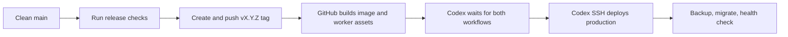

# Release and production deployment

NovaChat uses a patch-first release policy. Unless a major or minor bump is
explicitly requested, `vX.Y.Z` is released as `vX.Y.(Z+1)`.

## End-to-end flow



GitHub Actions does not receive production SSH credentials. It only builds and
publishes artifacts. Deployment is started from the trusted Codex host after all
release workflows have succeeded.

## One-time host configuration

The trusted host needs working SSH authentication for production and this local,
untracked configuration file:

```bash
install -d -m 700 ~/.config/novachat
printf '%s\n' 'NOVACHAT_DEPLOY_TARGET=root@production-host' \
  > ~/.config/novachat/deploy.env
chmod 600 ~/.config/novachat/deploy.env
```

Never commit the real production target, SSH private key, or deployment config.

## Publish and deploy

From a clean `main` branch that exactly matches `origin/main`:

```bash
scripts/release-and-deploy.sh
```

The script displays the latest tag and the next patch tag, asks for confirmation,
then performs:

1. `cargo test --workspace`.
2. `bun install --frozen-lockfile` and `bun run build` in `web/`.
3. Creation and push of an annotated release tag.
4. Waiting for both `docker.yml` and `worker-release.yml` to succeed.
5. Normalizing the GitHub Release title and marking it latest.
6. Direct SSH deployment from the trusted host.
7. Production health, HTTP, migration, database, restart-count, and log checks.

Useful options:

```bash
scripts/release-and-deploy.sh --dry-run       # show the next patch version only
scripts/release-and-deploy.sh --yes           # non-interactive confirmation
scripts/release-and-deploy.sh v1.2.0          # explicit non-patch bump
```

`--skip-checks` exists for an explicitly approved emergency release; it should
not be used in the normal flow.

## Production deployment behavior

The production script:

- accepts only a strict `vX.Y.Z` release tag;
- takes an online SQLite backup plus a Compose configuration backup;
- pulls the immutable release tag through the configured registry mirror;
- changes only the NovaChat image entry and recreates only that service;
- waits for Docker health and the local setup-status HTTP endpoint;
- verifies the resolved image, restart count, migrations, SQLite integrity, and
  critical logs;
- restores the previous Compose file and SQLite backup if deployment fails.

Backups are retained under `/opt/NovaChat/backups/releases/`. Old images are not
pruned automatically, so a previous release remains available for recovery.

## Retry deployment without a new release

```bash
scripts/deploy-production.sh vX.Y.Z
```

The deployment is idempotent: if that version is already healthy, the command
exits successfully without recreating the container.

## Failure handling

- A release workflow failure stops the process before production changes.
- A pull failure leaves the current container untouched.
- A failed container start or health check triggers automatic configuration and
  SQLite rollback.
- If automatic rollback cannot restore health, stop and inspect the production
  logs and the printed backup directory before making further changes.
